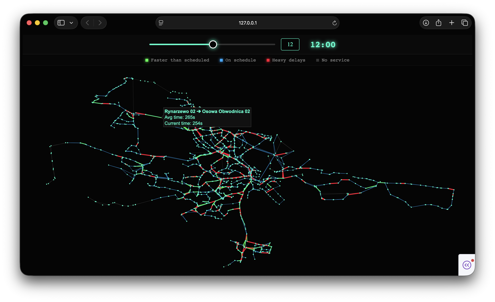

# NeptuNet: GTFS to Graph Converter & Traffic Digital Twin



## Overview
This project processes raw General Transit Feed Specification (GTFS) data from the ZTM Gdańsk API and transforms it into a fully functional, Time-Dependent directed graph structure. 

Beyond data processing, NeptuNet acts as a **Digital Twin of the urban transit network**. It features a reactive, web-based visualization engine that allows users to scrub through time and observe dynamic traffic conditions, delays, and scheduling anomalies across the entire city in a simulated environment.

## AI & Graph Theory Applications
The generated graph dataset is designed to be directly compatible with:
* **Search Algorithms:** Applying A* (A-star) or Dijkstra's algorithm for optimal route planning.
* **Time-Dependent Routing:** The graph stores dynamic schedules, allowing algorithms to calculate different optimal paths depending on the time of day (e.g., peak hours vs. night transit).
* **Graph Neural Networks (GNNs):** Providing a foundational topological dataset for predictive modeling.

## Core Architecture & Optimizations

### 1. Nodes (Vertices)
Nodes represent physical transit stops. 
* **Storage:** Stored in a Python `dictionary` (Hash Map) using `stop_id` as the key, ensuring O(1) lookup time.
* **Attributes:** `id`, `name`, `latitude`, `longitude`, `edges`.

### 2. Edges (Transit Connections)
Edges represent a direct, physical street segment between two consecutive stops. 
* **Deduplication:** The graph is optimized to represent physical topology. The raw dataset of over 2 million trips is compressed into a clean network of unique street segments.
* **Dynamic Schedules:** Each edge contains a `schedules` array, storing every single departure and traversal time that occurs on that street. 
* **Dynamic Baselines:** Calculates baseline traversal times for every specific street segment to allow for real-time anomaly detection.

### 3. Binary Caching System
Parsing raw GTFS `.txt` files is CPU-intensive. To improve Developer Experience (DX), the project utilizes Python's `pickle` module. 
* The parsed graph is serialized into a binary `graph_cache.pkl` file.
* Load times are reduced from **~30 seconds** to **under 0.1 seconds**.
* A `force_build` flag is available for cache invalidation when fetching new API data.

## Interactive Dashboard & Traffic Visualization

The project includes a high-performance rendering engine built with **Plotly** and served via a **Dash** web application. It acts as a real-time temporal map of the city's transit flow.

### Features
* **Time-Scrubbing Interface:** A slider allows users to control the time of day. The graph instantly updates to reflect the active schedules within a rolling 30-minute window.
* **Dynamic Edge Coloring (Heatmap):** Edges dynamically change color by comparing the schedule in the current time window against the historical average:
  * **Green (Faster):** Vehicles are traversing the segment faster than the average.
  * **Blue (On Schedule):** Vehicles are matching the expected baseline duration.
  * **Red (Heavy Delays):** Significant schedule delays/traffic congestion detected.
  * **Dark Grey (No Service):** The street is "asleep" with no active routes in the selected time window.
* **Interactive Tooltips:** Hovering over any active street segment reveals a hidden marker that displays the exact street name, the average historical travel time, and the current dynamic travel time.

## Setup & Usage

### Prerequisites
Make sure you have all required dependencies installed:
```bash
pip install pandas requests plotly dash